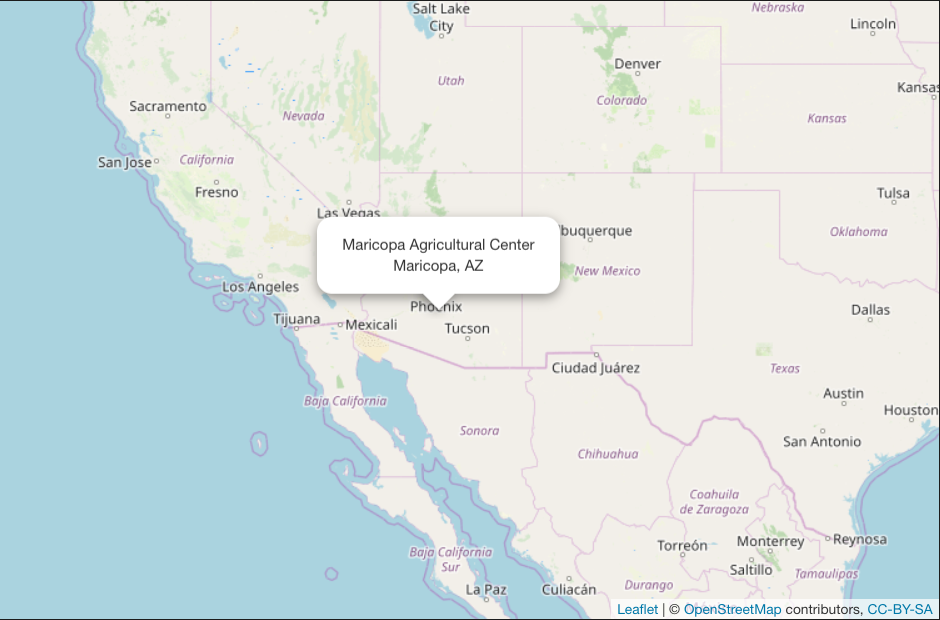
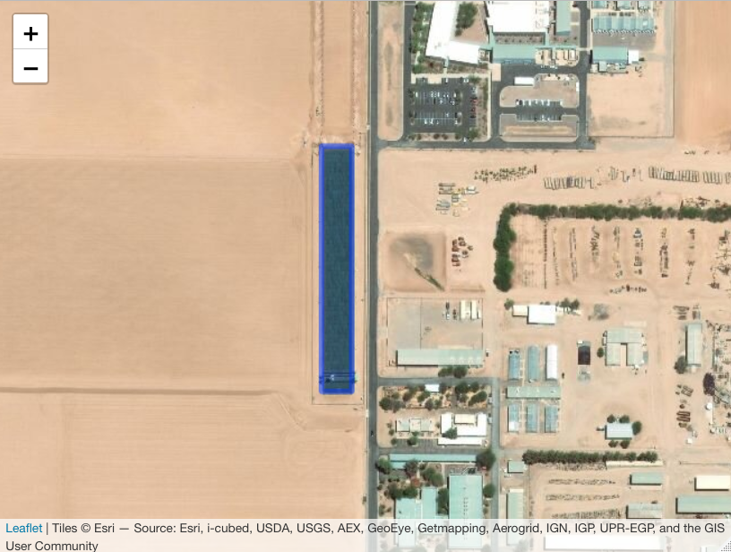

# Abstract

# Background and Summary

# Methods

## Field Site

```{r se-map, include = TRUE, fig.margin = TRUE, fig.cap = "Location of the Maricopa Agricultural Center", out.width='100%'}

```

```{r field-map, include = TRUE, fig.margin = TRUE, fig.cap = "", out.width='100%'}

```


The location of the field site is shown in figures \@ref(fig:se-map) and \@ref(fig:field-map).


## Field Scanner


- Field Scanner & Sensors

### Weather 

- Environmental Logger
- AZ Met Station


### Sensors

- Methods table summary 

## Experimental Design

- The first data release contains data from two Sorghum growing seasons, the 4th and 6th seasons of the project:  
- Field w/ plots overlaid. 
  - Figure: up-close image of plots from here: https://github.com/terraref/reference-data/issues/194
  - Definition of full plots and sub-plots

## Germplasm

## Phenotypes

### Sensor-Derived

### Manually Measured

## Data Processing Pipeline

- Figure: Overall data processing pipeline

# Data Records

## Field Scanner Sensors

- Figures: example from each sensor. Each should have measurement bar

* Stereo RGB
  * Zoomed in
    * Sunlit
    * Shaded
  * Mask
  * Plot level Clip
  * Field Mosaic
* FLIR
  * Zoomed in
  * Plot Level Clip
  * Field Mosaic
* Laser 3D
  * Zoomed in 
  * Plot Level Clip
* PS II
  * Zoomed in
  * Time Series
  
## Weather / Environment


### Soil 

Cite Markus' paper

### Geostreams

* Figure: Time series for each variable

### netCDF

* Figure: High res spectra

## Phenotypes

- Figures:
  - time series plot of each phenotype
  - time series plot of P-values for each phenotype (combine w/above as second panel)

# Technical Validation

- what has been done - technical analyses that quantify quality of measurements
  - Maria's proceedures
  - visualization 
      - fullfield, 
      - traitvis, 
      - plot overlaps https://github.com/terraref/reference-data/issues/194
  - what has max done?
- what has not been done
- known errors https://github.com/terraref/reference-data/issues?q=label%3Akind%2Fqaqc+

## Standards and Targets

- final acceptance tests
- regular use

### Laser Scanner

- laser height described here: https://github.com/terraref/reference-data/issues/263
- laser calibration point cloud issues https://github.com/terraref/reference-data/issues/254
  - only Left 3D sensor is affected. Recalibration was implemented Nov 2019 but data has not been reprocessed

### FLIR

- Image Deterioration mid-scan https://github.com/terraref/reference-data/issues/247
- In order to produce useful data, there needs to be a soil mask and the correct time of capture so that data can be aligned with air temperature https://github.com/terraref/reference-data/issues/284


## Visualization 

## Database constraints

https://www.overleaf.com/project/5d41e787eb35bf4afc09152e
- trait min/max
- other values

## Calibration 

## Genomics

## Cross-Comparison with other measurements

## Assumptions, Errors, and Limits 

- figure: mis-alignment of fullfield mosaic
- figure: errors in separating plant from soil 
- figure: from Max, GitHub illustrating limitations

# Useage Notes

## Specific Applications

Frame as user stories?

- Sensor data
- image analysis
- Machine Learning
- Crop breeding
- Genomics

### Machine Learning

- Using one sensor to predict contents of another (more expensive? sensor)
  - D3M
  - genophenoenvo
  - 


### Linking sensors, phenotypes, and genomics 

- SQLite database: https://github.com/Chris-Schnaufer/generate_sqlite

## Future Releases

- Search API

# Code Availability

All data is released to the public domain under the CC-0 license. All original software is licensed with the BSD-3 clause or MIT/BSD compatible license. All software used for data processing has been archived on Zenodo and is available on GitHub in the terraref organization: github.com/terraref.

This software was created specifically for the field scanner data processing pipeline that is described by @burnette2018. The file `code/source_code_dois.txt` provides the dois for code archives that contain the state of the software at the time the data were processed. Further development has been moved to github.com/agpipelines.

| Component                     | Github Organization / Repository                 | Archive Citation            |
|------------------------------|-----------------------------------|-----------------------------|
| TERRA REF Documentation      | terraref/documentation            | @david_lebauer_2020_3661373 |
| Reference Data               | terraref/reference-data           | @david_lebauer_2020_3635863 |
| Sensor Metadata              | terraref/sensor-metadata          | @craig_willis_2020_3635853  |
| Computing Pipeline           | terraref/computing-pipeline       | @max_burnette_2020_3635849  |
| terrautils Python Library    | terraref/terrautils               | @max_burnette_2019_3406335  |
| Metadata Processing          | terraref/extractors-metadata      | @max_burnette_2019_3406329  |
| Laser 3D Scanner             | terraref/extractors-3dscanner     | @max_burnette_2019_3406332  |
| Environmental Logger         | terraref/extractors-environmental | @max_burnette_2019_3406318  |
| Hyperspectral                | terraref/extractors-hyperspectral | @jeromemao_2019_3406312     |
| Multispectral, Thermal, PSII | terraref/extractors-multispectral | @max_burnette_2019_3406311  |
| Stereo RGB                   | terraref/extractors-stereo-rgb    | @max_burnette_2019_3406304  |


# Acknowledgements

The work presented herein was funded by 
  the Advanced Research Projects Agency-Energy (ARPA-E), U.S. Department of Energy, under Award Number DE-AR0000598, 
  by the USDA National Institute of Food and Agriculture, Hatch General Administration of Federal-Grant Fund Research 30152. 
Computational support was provided by the National Center for Supercomputing Applications and the Extreme Science and Engineering Discovery Environment (XSEDE), which is supported by National Science Foundation grant number ACI-1548562. 
We thank Mats Rynge for his assistance with refactoring the TERRA REF pipeline into a portable workflow, which was made possible through the XSEDE Extended Collaborative Support Service (ECSS) program.

# Author Contributions


# Competing Interests

The authors declare no competing interests.

# References
